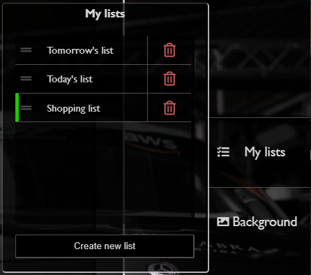
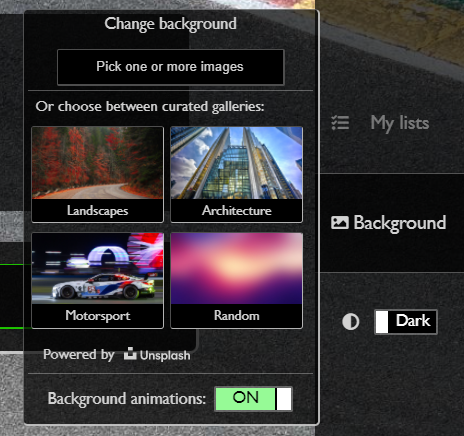

# The Ultimate To-do List

This is a simple - yet powerful - to-do list created with HTML, CSS/SASS, and Vanilla JavaScript.

## Table of contents
  - [Introduction](#introduction)
  - [Technologies](#technologies)
  - [Functionalities](#functionalities)
  - [Acknowledgements](#acknowledgements)
  - [License](#license)

## Introduction
This idea came from various youtubers ([Dev Ed](https://www.youtube.com/channel/UClb90NQQcskPUGDIXsQEz5Q), [Web Dev Simplified](https://www.youtube.com/channel/UCFbNIlppjAuEX4znoulh0Cw), [Free Code Camp](https://www.youtube.com/channel/UC8butISFwT-Wl7EV0hUK0BQ)) whose channels are based on web and software development. This is a training project, and its purpose while building was to practice my skills and knowledge regarding frontend web development.

This to-do list has a considerable set of features that will be listed [here](#functionalities).

## Technologies

This project was written entirely with:
* HTML5
* CSS3, with SASS
* Vanilla JavaScript, using :
  * [SortableJS](https://sortablejs.github.io/Sortable/) library.
  * [Unsplash](https://unsplash.com/developers) API.

## Functionalities

With this application the user will be able to:

### To-do-related

1. Create, edit, move around, and delete tasks (has support for ENTER and ESC keys).
2. Create, edit, move around and delete to-do lists.
3. Access his information later, as the information will be stored in his machine.

    

### Customization-related

1. Change between *Dark* and *Light* themes with the flip of a switch.
2. Change the background image for:
    * Custom images from his file explorer.
    * Curated images from [Unsplash](https://unsplash.com/) website through its [API](https://unsplash.com/developers).
3. Turn on/off beautiful animations for his background.

    

## Acknowledgements

I want to thank all the following resources and people for helping me build this project:

- [Free Code Camp](https://www.youtube.com/channel/UC8butISFwT-Wl7EV0hUK0BQ)'s YouTube channel and online courses.
- [Web Dev Simplified](https://www.youtube.com/channel/UCFbNIlppjAuEX4znoulh0Cw)'s YouTube channel.
- [Steve Griffith (Coding Jesus)](https://www.youtube.com/c/SteveGriffith-Prof3ssorSt3v3)'s YouTube channel
- [Dev Ed](https://www.youtube.com/channel/UClb90NQQcskPUGDIXsQEz5Q)'s YouTube channel.
- All the people that built and maintain [MDN Web Docs](https://developer.mozilla.org/es/)
- All the awesome community from StackOverflow
- My parents, brother, closest family, and friends (coders and non-coders).

## License

This project is licensed *(I guess)* under the MIT License.
